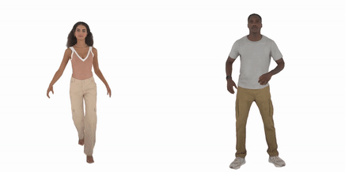

# Frequency-Decomposed Avatar Representation for Varying Camera Distances

### [Projectpage](https://david-svitov.github.io/CloseUpAvatar_project_page/index.html) · [Paper](https://arxiv.org/abs/2512.03593)



## Installation

1. We provide a [Docker image](../docker) for easy and fast installation. To build and run the container, please use the following commands:
   ```shell
   bash ./docker/build.sh
   bash ./docker/run.sh
   ```
   As a result, you will have your filesystem available in the `/mounted` subfolder inside the container.

2. Next, build and install BBSplat and other GPU-dependent libraries:
   ```shell
   bash bbsplat_install.sh
   ```
   
## Dataset Preparation

This data preparation instruction is copied from the [MMLPHuman GitHub](https://github.com/1231234zhan/mmlphuman)

1. Download the [ActorsHQ](https://actors-hq.com/) or [THuman4.0](https://github.com/ZhengZerong/THUman4.0-Dataset) datasets.
2. For the ActorsHQ dataset, download the SMPL-X registration from [here](https://drive.google.com/file/d/1DVk3k-eNbVqVCkLhGJhD_e9ILLCwhspR/view?usp=sharing), and place `smpl_params.npz` at the corresponding root path of each subject.
3. Generate the LBS weight volume. 
   - Follow [this link](https://github.com/lizhe00/AnimatableGaussians/blob/master/gen_data/GEN_DATA.md#Preprocessing) to compile the executable file `PointInterpolant`.
   - Change the executable file path in `script/gen_weight_volume.py`. Then run
    ```shell
    cd script
    python gen_weight_volume.py --data_dir {DATASET_DIR} --smpl_path ../smpl_model/smplx/SMPLX_NEUTRAL.npz
    ```

The datasets will look like this after preparation: 
```
AvatarReX dataset
├── 22010708 
├── 22010710 
├── calibration_full.json
├── gaussian
│   ├── lbs_weights_grid.npz
│   └── template.ply
└── smpl_params.npz

THuman4.0 dataset
├── calibration.json
├── gaussian
│   ├── lbs_weights_grid.npz
│   └── template.ply
├── images
│   ├── cam00 
│   └── cam01 
├── masks
│   ├── cam00 
│   └── cam01
└── smpl_params.npz

ActorsHQ dataset
├── calibration.csv
├── gaussian
│   ├── lbs_weights_grid.npz
│   └── template.ply
├── masks
│   ├── Cam001 
│   └── Cam002
├── rgbs
│   ├── Cam001 
│   └── Cam002 
└── smpl_params.npz
```

## Training

First update ```smpl_pkl_path``` path to SMPL-X model in the ```./config/*.yaml``` configs you intended to use.

For training selected avatars, you can use the following script:
```shell
train.py 
```

To train all avatars, please run:
```shell
bash run_train.sh
```
Note, that you have to update ```--data_dir``` in the .sh script with the path to your data.

## Test and Evaluation

For rendering and evaluating the resulting avatars you can use one of the following scripts.

For rendering all avatars and evaluating metrics:
```shell
bash run_test.sh
```
 
For rendering in novel poses:
```shell
bash run_new_poses.sh
```

## Pretrained Models

Metrics obtained by evaluating the pretrained checkpoints with `run_test.sh`.

### ActorsHQ

| Actor                                                                                         | Zoom-in PSNR ↑ | Zoom-in SSIM ↑ | Zoom-in LPIPS ↓ | Zoom-in FID ↓ | Zoom-out PSNR ↑ | Zoom-out SSIM ↑ | Zoom-out LPIPS ↓ | Zoom-out FID ↓ |
|-----------------------------------------------------------------------------------------------|---|---|---|---|---|---|---|---|
| [Actor01](https://drive.google.com/file/d/1-PqRZqHo6p7hoGdTt3CjQ5LbN2K2V-5H/view?usp=sharing) | 27.24 | 0.717 | 0.215 | 46.04 | 36.73 | 0.991 | 0.029 | 18.22 |
| [Actor02](https://drive.google.com/file/d/1UzY1KcUJH2DhmU27ph4uIYoBL4gBCeUH/view?usp=sharing) | 26.65 | 0.726 | 0.220 | 33.71 | 37.03 | 0.990 | 0.030 | 23.69 |
| [Actor04](https://drive.google.com/file/d/1-6-ODqIFZIYBzfVwDOlxHKpmaxrYTUOi/view?usp=sharing) | 24.33 | 0.775 | 0.208 | 30.74 | 36.13 | 0.991 | 0.030 | 15.55 |
| [Actor05](https://drive.google.com/file/d/1ADFuMtSfjERrnOEH4tQnZCklKb75R7vP/view?usp=sharing) | 28.36 | 0.723 | 0.258 | 44.74 | 36.51 | 0.991 | 0.035 | 24.11 |
| [Actor06](https://drive.google.com/file/d/1L9zlwYA2UqxvuXOJLhDh8gm7BIu79psF/view?usp=sharing) | 28.76 | 0.747 | 0.209 | 29.45 | 35.91 | 0.992 | 0.033 | 36.82 |
| [Actor07](https://drive.google.com/file/d/1EiLfkaU4qdgvonmnoqUNMlNwuDMJRKZp/view?usp=sharing) | 29.12 | 0.711 | 0.228 | 37.46 | 37.12 | 0.990 | 0.032 | 22.56 |
| [Actor08](https://drive.google.com/file/d/1VgTTQOYreaLf4Desd5vvjeLeKEpwPK1N/view?usp=sharing) | 29.42 | 0.746 | 0.229 | 47.37 | 35.64 | 0.989 | 0.030 | 13.74 |
| **Average**                                                                                   | **27.70** | **0.735** | **0.224** | **38.50** | **36.44** | **0.990** | **0.031** | **22.10** |

### THuman4.0

| Subject       | PSNR ↑ | SSIM ↑ | LPIPS ↓ | FID ↓ |
|---------------|---|---|---|---|
| [subject00](https://drive.google.com/file/d/1WenfiJaPwIPWZfoiMJpgU2OurzFbqVVW/view?usp=sharing) | 27.68 | 0.973 | 0.047 | 23.70 |

## Acknowledgement
This project is based on the [MMLPHuman](https://github.com/1231234zhan/mmlphuman) repository. We greatly thank the authors for their wonderful work.

## Citation
```bibtex
@article{svitov2025closeup,
  title={CloseUpAvatar: High-Fidelity Animatable Full-Body Avatars with Mixture of Multi-Scale Textures},
  author={Svitov, David and Morerio, Pietro and Agapito, Lourdes and Del Bue, Alessio},
  year={2025},
  eprint={2512.03593},
  archivePrefix={arXiv},
  primaryClass={cs.CV},
  url={https://arxiv.org/abs/2512.03593},
}
```